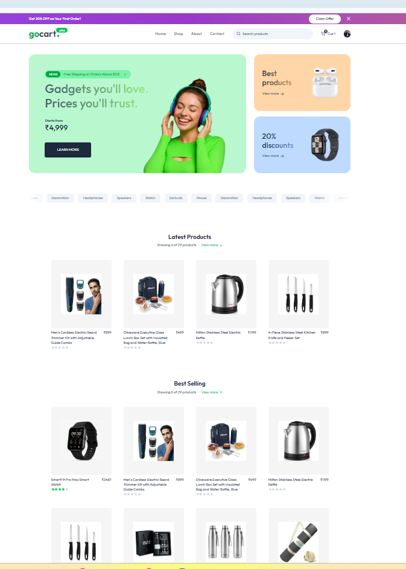
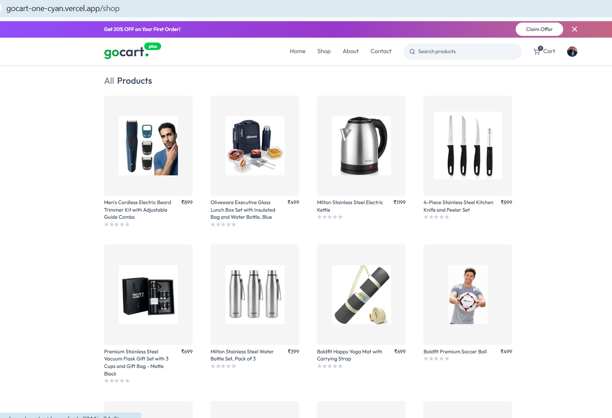
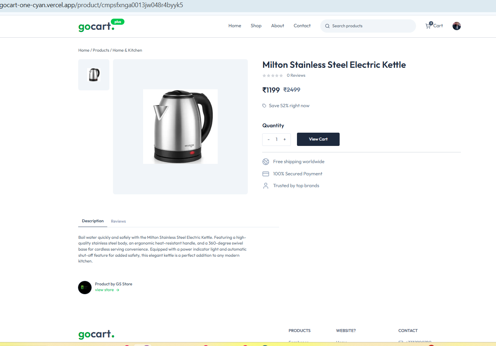
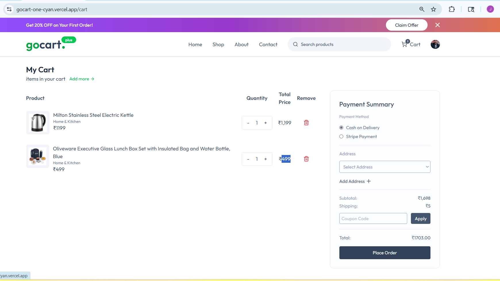
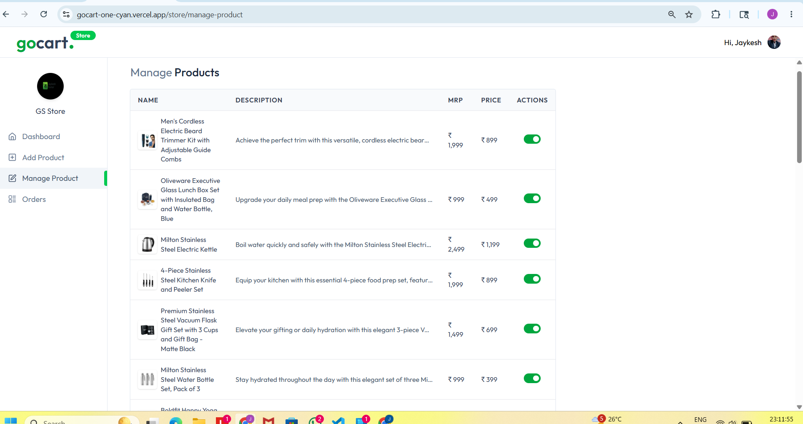
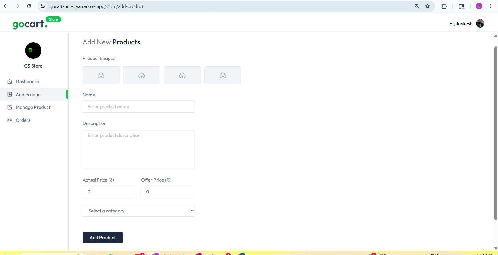
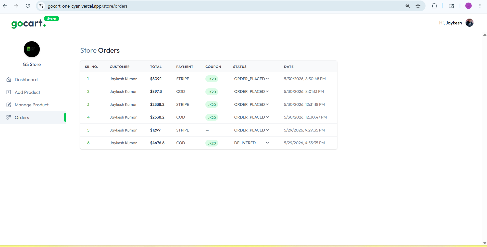

# GoCart - Multi Vendor E-Commerce Platform

🚀 Live Demo: https://gocart-one-cyan.vercel.app/

## Overview

GoCart is a full-stack multi-vendor e-commerce platform where customers can browse products, manage carts, place orders, and track purchases. Vendors can create stores, add products, manage inventory, and process orders through a dedicated seller dashboard.

The platform also includes AI-powered product information generation, secure authentication, coupon management, ratings & reviews, and Stripe payment integration.

---

## Features

### Customer Features

* User Authentication with Clerk
* Browse Products
* Product Categories
* Add to Cart
* Address Management
* Apply Coupons
* Order Placement
* Order History
* Ratings & Reviews

### Seller Features

* Create and Manage Store
* Seller Dashboard
* Add/Edit Products
* AI Generated Product Details
* Inventory Management
* Order Management

### Admin Features

* Store Approval System
* Coupon Management
* Platform Monitoring

---

## Tech Stack

### Frontend

* Next.js 15
* React.js
* Tailwind CSS
* Axios

### Backend

* Next.js API Routes
* Prisma ORM

### Database

* PostgreSQL
* Neon Database

### Authentication

* Clerk Authentication

### Payments

* Stripe
* Cash on Delivery (COD)

### AI Integration

* OpenAI API

### Deployment

* Vercel

---

## Screenshots

### Home Page


### Shop Page


### Product Details


### Cart


### Seller Dashboard


### AI Product Generation


### Orders



---

## Installation

```bash
git clone <your-repository-url>
cd gocart
npm install
npm run dev
```

Open http://localhost:3000

---

## Environment Variables

```env
DATABASE_URL=
DIRECT_URL=

NEXT_PUBLIC_CLERK_PUBLISHABLE_KEY=
CLERK_SECRET_KEY=

OPENAI_API_KEY=
OPENAI_MODEL=

STRIPE_SECRET_KEY=
STRIPE_WEBHOOK_SECRET=
```

---

## Author

Jaykesh Kumar

LinkedIn:
https://www.linkedin.com/in/jaykesh-kumar-553070325/

GitHub:
https://github.com/JAYKESH-KUMAR

---

## Live Project

https://gocart-one-cyan.vercel.app/
